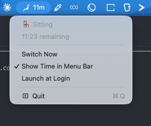

# stint


A minimal macOS menu bar app for sit/stand reminders.

Alternates between sitting and standing every 30 minutes — the interval [recommended by ergonomics researchers](https://uwaterloo.ca/news/how-long-should-you-stand-rather-sit-your-work-station) for reducing the risks of prolonged sitting. No configuration needed.



## Why "stint"?

A *stint* means a fixed period of work or duty — exactly what each sit/stand interval is. The word also contains *st(and)* and *(s)it*.

## Features

- 30-minute sit/stand interval with automatic switching
- Menu bar icon with remaining time
- macOS notifications on state change
- Icon blinking on auto-switch
- Show/hide time in menu bar
- Launch at Login
- Sleep/wake detection

## Install

Download the latest DMG from [Releases](https://github.com/mrskiro/stint/releases), open it, and drag Stint to Applications.

Signed and notarized — no Gatekeeper warnings.

## Build from source

Requires macOS 14+ and Swift 6.

```
swift build
```

## License

[MIT](LICENSE)
